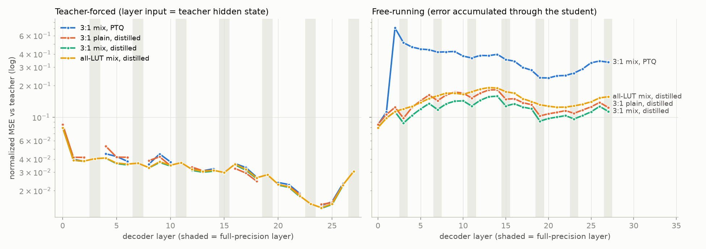

# Qwen3-0.6B-Base 混合 LUT 模型：逐层蒸馏结果（FineWeb sample-10BT）

日期：2026-10-08 ・ 分支：`blockwise-distill`（仅本地，未 push）・ 硬件：8× H100

本轮按审阅确认的方案执行：
- Base 模型；
- LUT 层只量化激活（v=2，64 个质心）；
- 全精度层严格 BF16，采用方案 A（3:1，FP 层为 3, 7, …, 27）；
- 允许更新权重。

## 1. 结论

1. **按层蒸馏有效，3:1 混合明显优于全 LUT。**
   - 最优配置为 3:1 A + mix 变换 + seq 模式。
   - wikitext2 PPL 从 PTQ 的 19.31 降到 **15.40**（FP 为 12.67），与 FP 的差距缩小 59%。
   - FineWeb 困惑度从 30.40 降到 **23.40**（FP 为 19.90），差距缩小 67%。
   - 只用了 1000 万 token，2 张 H100 约 15 分钟。
2. **同样蒸馏后，3:1 比全 LUT 好得多**（wikitext2 15.40 vs 17.06，KL 0.172 vs 0.263）。即使 FP 层冻结，也能衰减累积误差，见 §3 图中的"锯齿"。
3. **蒸馏几乎不降低每层的局部误差，主要降低的是误差在层间的累积。**
   - teacher-forced 曲线（输入用 teacher 隐状态时的单层误差）在 PTQ 和蒸馏后几乎重合。
   - free-running 曲线（学生完整前向的累积误差）大幅下降。PTQ 在第 2 层误差暴涨（0.11 → 0.71），这里正是 Qwen massive activation 形成的位置；蒸馏后为 0.11。
4. **这个目标函数很早就饱和了。** 约 500 万 token 后 KL 停在 0.175 左右，再多的 token 没有帮助；高学习率维持过久还会缓慢变差。所以原计划的 1 亿 token 正式实验没有跑（见 §4 偏离说明）。
5. **zero-shot 平均分（6 个任务）**：FP 55.4，PTQ 51.2，蒸馏后 52.0–52.9。LAMBADA 准确率 43.5 → 44.1–47.5，FP 为 54.3。要继续逼近 FP，需要轻量的端到端 logits 蒸馏（方案中的 Stage 2，本轮未做，见 §5）。

## 2. 最终结果

- FineWeb 指标在 held-out 的 256×2048 token 上计算。
- KL 为 KL(teacher‖student)，top-1 为与 teacher 的 top-1 一致率。
- zero-shot 用 lm-eval 0.4.13：ARC 和 HellaSwag 报告 acc_norm，其余报告 acc。

| 配置 | FineWeb PPL | wikitext2 PPL | KL | top-1 | ARC-e | ARC-c | HellaS | PIQA | Wino | LAMBADA | 平均(6) | LAMBADA PPL |
|---|---|---|---|---|---|---|---|---|---|---|---|---|
| FP（BF16 teacher） | 19.90 | 12.67 | 0.001 | 0.977 | 58.0 | 38.1 | 53.8 | 69.8 | 58.7 | 54.3 | 55.4 | 9.6 |
| 3:1 A plain，PTQ | 59.02 | 39.69 | 1.105 | 0.543 | 54.8 | 30.1 | 44.0 | 64.8 | 53.0 | 22.2 | 44.8 | 1234 |
| 3:1 A mix，PTQ | 30.40 | 19.31 | 0.434 | 0.707 | 58.2 | 34.6 | 48.2 | 66.6 | 56.2 | 43.5 | 51.2 | 19.8 |
| 全 LUT mix，PTQ | 30.34 | 19.63 | 0.432 | 0.680 | 55.8 | 31.5 | 46.5 | 65.1 | 55.1 | 38.4 | 48.7 | 33.6 |
| 3:1 A plain，蒸馏（seq） | 24.45 | 16.34 | 0.218 | 0.755 | 57.3 | 34.0 | 47.5 | 65.5 | 56.3 | 40.3 | 50.1 | 20.4 |
| 3:1 A mix，蒸馏（group） | 23.60 | **15.35** | 0.181 | 0.778 | 61.6 | 34.8 | **49.1** | 66.9 | **57.1** | **47.5** | **52.9** | **15.9** |
| **3:1 A mix，蒸馏（seq）** | **23.40** | 15.40 | **0.172** | **0.782** | **62.2** | **35.8** | 48.4 | **67.1** | 54.6 | 44.1 | 52.0 | 17.8 |
| 全 LUT mix，蒸馏（seq） | 25.56 | 17.06 | 0.263 | 0.728 | 61.8 | 34.6 | 46.9 | 66.8 | 55.1 | 37.5 | 50.4 | 24.1 |

术语说明：
- **mix**：down_proj 输入做 randomized Hadamard 旋转，其余 linear 输入做 per-token gain-shape 归一化。
- **plain**：不做任何变换。
- **seq 模式**：每组的输入是前面学生层的输出（已 detach）。
- **group 模式**：每组的输入是 teacher 的隐状态（teacher-forced）。

如何读这张表：
- **group 与 seq 的差别在噪声范围内。** seq 在 KL 和 FineWeb PPL 上略好，group 在 zero-shot 平均分上略好。lm-eval 单项的标准误约 1–1.5 分，Winogrande 和 LAMBADA 的差异不宜过度解读。
- **ARC-e 蒸馏后高于 FP（62 vs 58）。** 这一现象可能来自 FineWeb 领域的蒸馏数据，也可能是噪声，暂不作为结论。
- **PTQ 行有较大的随机性。** k-means 初始化在不同运行间波动很大：同一配置在 32 条序列上的 step-0 PPL 在 27–35 之间。蒸馏后这一差异会在 25 步内消失。

## 3. 逐层误差曲线



- 纵轴是按 teacher 逐通道 RMS 归一化的 MSE（对数坐标），灰色竖条是全精度层。
- 左图（teacher-forced）中略去了 FP 层：它们只有 FP32 与 BF16 的数值噪声（约 1e-5）。
- 左图里四条曲线几乎重合。这说明在 3 bit/dim 的激活 VQ 下，单层局部误差（约 0.02–0.08）基本由量化码率决定，蒸馏改变不了它。
- 第 0 层的局部误差最大（0.08）。
- 右图中蒸馏后的误差整体降到 0.09–0.16。每个 FP 层（3, 7, 11, 15, 19, 23）处累积误差都会下降，即使这些层是冻结的，也起到了"误差衰减"的作用。
- 全 LUT 的曲线没有这种回落，中后段始终高于 3:1。

## 4. 过程中的发现，以及与方案的偏离

| 实验 | 结论 |
|---|---|
| plain vs mix（试跑，20M token） | mix 在 PTQ 下优势巨大（PPL 61 vs 29）；蒸馏后 plain 追回大部分（16.34 vs 15.40），但 mix 始终更好 |
| group（teacher-forced）模式 | 约 300 万 token 达到最优，之后 KL 缓慢上升（0.182 → 0.202） |
| seq 模式 | 下降更稳定，最优 KL 更低（0.172–0.175） |
| 权重 lr 1e-5 / 5e-5 / 1e-4 | 差别很小；1e-4 起步快，之后略差 |
| FP 层参与训练（作为补偿层） | 没有收益：group 模式下与冻结相同（0.182 vs 0.182），seq 模式下略差（0.181 vs 0.175）。默认冻结 |
| 损失：nmse vs relmse | 无差别 |
| 冻结权重、只训练码本 | 更差且不稳定（最优 KL 0.188，在 0.19–0.24 之间波动；其余设置为 0.174–0.175），说明更新权重是必要的 |
| 码本是否接收 task 梯度、码本 lr 1e-4、死质心重启 | 三者都收敛到同一平台（最优 KL 0.174–0.175）。实测死质心比例只有约 0.03%，"码本漂移导致变差"的假设被排除 |
| 长训练（40M token，cosine） | 高学习率维持过久会缓慢变差；短调度（10M token）没有这个问题 |

与方案的偏离：
1. **正式实验的 token 数从 1 亿改为 1000 万。** 目标函数在约 500 万 token 时已饱和，更长的训练只会变差。
2. **改为保存"最优 checkpoint"。** 每 25 步在 32 条 held-out 序列上按 KL 选择。这 32 条也包含在最终评测的 256 条中，存在轻微的选择偏差。
3. **Stage 2 端到端 KD 没有做。** 方案中它被标为"仅在 Stage 1 不够时、默认不做"，需要你决定（见 §5）。
4. **E1 敏感度扫描没有做。** 它只服务于方案 B，本轮只跑 A。

## 5. 建议的下一步（需要你决定）

1. **Stage 2：轻量端到端蒸馏。**
   - 损失为 logits 的 KL 加上各层隐状态 MSE，数据量约 2000–5000 万 token。
   - §3 已经说明逐层目标存在上限，而剩余差距（KL 0.17，zero-shot 低 2.5–3.4 分）是端到端性质的。这是最可能有效的一步。
2. **方案 B / C。**
   - 方案 B：按敏感度选择 FP 层。第 0 层局部误差最大、第 2 层累积误差最严重，可以考虑把第 0–2 层之一设为 FP，这可能比周期摆放更好。
   - 方案 C：层内只保留 down_proj 为 FP。
3. **权重 VQ（GPTVQ）和 INT8 表**，在蒸馏后的 checkpoint 上做，才能得到论文最终的硬件形态。

## 6. 代码与复现

| 文件 | 内容 |
|---|---|
| `lutneuro/ops/lut_linear.py` | k-means 初始化接口、`distance_p` 生效（L2/L∞）、randomized Hadamard（含 12·2^k）、gain-shape、`codebook_task_grad`、分块最近质心搜索、`bypass`、使用率统计与死质心重启 |
| `lutneuro/config/__init__.py` | 新字段：`lut_layers`、`quantize_lm_head`、`transform`、`beta`、`codebook_task_grad`、`assign_chunk`。默认值与原行为一致 |
| `lutneuro/models/lut_model.py` | 只替换指定的 decoder 层；可选不替换 lm_head（保持 tied）；加载 tied checkpoint |
| `lutneuro/ops/kmeans.py` | 批量 k-means，以及基于 FP 激活的逐层初始化 |
| `lutneuro/distill.py` | teacher 隐状态、逐通道 RMS、nmse、逐层评测（teacher-forced / free-running / PPL / KL） |
| `scripts/prepare_fineweb.py` | 下载 FineWeb 两个 shard、分词并打包：train 2.1 亿、calib 200 万、held-out 200 万 token |
| `scripts/distill_blockwise.py` | 蒸馏主脚本，支持 group / layer / seq 模式，手动 DDP 梯度平均，保存最优 checkpoint |
| `scripts/eval_layerwise.py` | 最终评测，含 wikitext2 和 lm-eval |
| `scripts/plot_layerwise.py` | 绘制逐层曲线 |
| `configs/distill_{A,all}_{plain,mix}.yaml` | 实验配置 |

```bash
# 环境：~/mlsys/lut-llm/.venv（叠加在 ~/mlsys/venv 上，另装 pyarrow / matplotlib / lm-eval / accelerate）
~/mlsys/lut-llm/.venv/bin/python scripts/prepare_fineweb.py                    # 约 15 分钟
scripts/launch.sh 0,1 29641 F1_A_mix_seq --lut_config configs/distill_A_mix.yaml --mode seq --train_tokens 10e6 --eval_every 25
PYTHONPATH=. ~/mlsys/lut-llm/.venv/bin/python scripts/eval_layerwise.py --ckpt checkpoints/F1_A_mix_seq/best --lm_eval --out results/F1_A_mix_seq.json
```

- checkpoint 位于 `checkpoints/<exp>/{best,final}/`：`model.safetensors`（fp32，不含 tied 的 lm_head）、`lut_config.yaml`、`meta.json`。
- 加载方式：`AutoModelForLutLM.from_pretrained(..., lut_config=LUTConfig(**yaml, checkpoint=dir))`。
- 训练与评测日志在 `checkpoints/<exp>/*.jsonl` 和 `logs/`。
