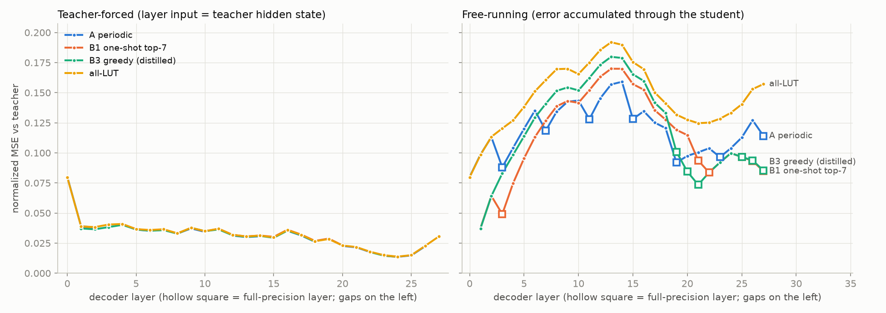

# Qwen3-0.6B-Base 混合 LUT 模型：逐层蒸馏结果（FineWeb sample-10BT）

日期：2026-10-08 ・ 分支：`blockwise-distill`（仅本地，未 push）・ 硬件：8× H100

本轮按审阅确认的方案执行：
- Base 模型；
- LUT 层只量化激活（v=2，64 个质心）；
- 全精度层严格 BF16，采用方案 A（3:1，FP 层为 3, 7, …, 27）；
- 允许更新权重。

## 00. 更新（2026-10-08）：Stage 2 端到端蒸馏

在 Stage 1 checkpoint 的基础上，再用 2500 万 FineWeb token 做端到端蒸馏。损失为 logits 的 KL 加上逐层隐状态 MSE（权重 1），8 张 H100 上两组各占 4 卡并行，约 40 分钟。结果：

| 配置 | 与 teacher 的 KL | wikitext2 PPL | 6 项 zero-shot 平均 |
|---|---|---|---|
| **B1 + Stage 2（当前最优）** | 0.141 → **0.128** | 14.69 → **14.47**（FP 12.67） | 52.1 → **53.9**（FP 55.4） |
| A + Stage 2 | 0.172 → 0.154 | 15.40 → 15.01 | 52.0 → 53.5 |

- LAMBADA 准确率提升 4–5 分，困惑度从 16–18 降到约 13。
- zero-shot 与 FP 的差距从约 3.3 分缩小到 1.5 分。
- 只用 logits KL 几乎没有收益，必须保留逐层 MSE 作为正则。

详见 §8。

## 0. 更新（2026-10-08）：方案 B（按敏感度选 FP 层）

在同样的 7 个 FP 层、相同训练配方（mix + seq + 1000 万 token）下：
- 把 FP 层放到敏感层上之后，与 teacher 的 KL 从 0.172 降到 **0.141**（−18%）；
- wikitext2 PPL 从 15.40 降到 **14.69**，与 FP 的差距缩小 26%；
- LAMBADA 困惑度从 17.8 降到 **15.1–16.0**；
- zero-shot 平均分与方案 A 无法区分。

最便宜的选法（单层 PTQ 敏感度：28 次评测约 20 秒，另加约 2 分钟的模型加载和 k-means 初始化）与最贵的选法（在蒸馏后的全 LUT 模型上做 greedy）效果相同。详见 §7。

## 1. 结论

1. **按层蒸馏有效，3:1 混合明显优于全 LUT。**
   - 最优配置为 3:1 A + mix 变换 + seq 模式。
   - wikitext2 PPL 从 PTQ 的 19.31 降到 **15.40**（FP 为 12.67），与 FP 的差距缩小 59%。
   - FineWeb 困惑度从 30.40 降到 **23.40**（FP 为 19.90），差距缩小 67%。
   - 只用了 1000 万 token，2 张 H100 约 15 分钟。
2. **同样蒸馏后，3:1 比全 LUT 好得多**（wikitext2 15.40 vs 17.06，KL 0.172 vs 0.263）。即使 FP 层冻结，也能衰减累积误差，见 §3 图中的"锯齿"。
3. **蒸馏几乎不降低每层的局部误差，主要降低的是误差在层间的累积。**
   - teacher-forced 曲线（输入用 teacher 隐状态时的单层误差）在 PTQ 和蒸馏后几乎重合。
   - free-running 曲线（学生完整前向的累积误差）大幅下降。PTQ 在第 2 层误差暴涨（0.11 → 0.71），这里正是 Qwen massive activation 形成的位置；蒸馏后为 0.11。
4. **这个目标函数很早就饱和了。** 约 500 万 token 后 KL 停在 0.175 左右，再多的 token 没有帮助；高学习率维持过久还会缓慢变差。所以原计划的 1 亿 token 正式实验没有跑（见 §4 偏离说明）。
5. **zero-shot 平均分（6 个任务）**：FP 55.4，PTQ 51.2，蒸馏后 52.0–52.9。LAMBADA 准确率 43.5 → 44.1–47.5，FP 为 54.3。要继续逼近 FP，需要轻量的端到端 logits 蒸馏（方案中的 Stage 2，本轮未做，见 §5）。

## 2. 最终结果

- FineWeb 指标在 held-out 的 256×2048 token 上计算。
- KL 为 KL(teacher‖student)，top-1 为与 teacher 的 top-1 一致率。
- zero-shot 用 lm-eval 0.4.13：ARC 和 HellaSwag 报告 acc_norm，其余报告 acc。

| 配置 | FineWeb PPL | wikitext2 PPL | KL | top-1 | ARC-e | ARC-c | HellaS | PIQA | Wino | LAMBADA | 平均(6) | LAMBADA PPL |
|---|---|---|---|---|---|---|---|---|---|---|---|---|
| FP（BF16 teacher） | 19.90 | 12.67 | 0.001 | 0.977 | 58.0 | 38.1 | 53.8 | 69.8 | 58.7 | 54.3 | 55.4 | 9.6 |
| 3:1 A plain，PTQ | 59.02 | 39.69 | 1.105 | 0.543 | 54.8 | 30.1 | 44.0 | 64.8 | 53.0 | 22.2 | 44.8 | 1234 |
| 3:1 A mix，PTQ | 30.40 | 19.31 | 0.434 | 0.707 | 58.2 | 34.6 | 48.2 | 66.6 | 56.2 | 43.5 | 51.2 | 19.8 |
| 全 LUT mix，PTQ | 30.34 | 19.63 | 0.432 | 0.680 | 55.8 | 31.5 | 46.5 | 65.1 | 55.1 | 38.4 | 48.7 | 33.6 |
| 3:1 A plain，蒸馏（seq） | 24.45 | 16.34 | 0.218 | 0.755 | 57.3 | 34.0 | 47.5 | 65.5 | 56.3 | 40.3 | 50.1 | 20.4 |
| 3:1 A mix，蒸馏（group） | 23.60 | **15.35** | 0.181 | 0.778 | 61.6 | 34.8 | **49.1** | 66.9 | **57.1** | **47.5** | **52.9** | **15.9** |
| **3:1 A mix，蒸馏（seq）** | **23.40** | 15.40 | **0.172** | **0.782** | **62.2** | **35.8** | 48.4 | **67.1** | 54.6 | 44.1 | 52.0 | 17.8 |
| 全 LUT mix，蒸馏（seq） | 25.56 | 17.06 | 0.263 | 0.728 | 61.8 | 34.6 | 46.9 | 66.8 | 55.1 | 37.5 | 50.4 | 24.1 |

术语说明：
- **mix**：down_proj 输入做 randomized Hadamard 旋转，其余 linear 输入做 per-token gain-shape 归一化。
- **plain**：不做任何变换。
- **seq 模式**：每组的输入是前面学生层的输出（已 detach）。
- **group 模式**：每组的输入是 teacher 的隐状态（teacher-forced）。

如何读这张表：
- **group 与 seq 的差别在噪声范围内。** seq 在 KL 和 FineWeb PPL 上略好，group 在 zero-shot 平均分上略好。lm-eval 单项的标准误约 1–1.5 分，Winogrande 和 LAMBADA 的差异不宜过度解读。
- **ARC-e 蒸馏后高于 FP（62 vs 58）。** 这一现象可能来自 FineWeb 领域的蒸馏数据，也可能是噪声，暂不作为结论。
- **PTQ 行有较大的随机性。** k-means 初始化在不同运行间波动很大：同一配置在 32 条序列上的 step-0 PPL 在 27–35 之间。蒸馏后这一差异会在 25 步内消失。

## 3. 逐层误差曲线


- 纵轴是按 teacher 逐通道 RMS 归一化的 MSE（对数坐标），灰色竖条是全精度层。
- 左图（teacher-forced）中略去了 FP 层：它们只有 FP32 与 BF16 的数值噪声（约 1e-5）。
- 左图里四条曲线几乎重合。这说明在 3 bit/dim 的激活 VQ 下，单层局部误差（约 0.02–0.08）基本由量化码率决定，蒸馏改变不了它。
- 第 0 层的局部误差最大（0.08）。
- 右图中蒸馏后的误差整体降到 0.09–0.16。每个 FP 层（3, 7, 11, 15, 19, 23）处累积误差都会下降，即使这些层是冻结的，也起到了"误差衰减"的作用。
- 全 LUT 的曲线没有这种回落，中后段始终高于 3:1。

## 4. 过程中的发现，以及与方案的偏离

| 实验 | 结论 |
|---|---|
| plain vs mix（试跑，20M token） | mix 在 PTQ 下优势巨大（PPL 61 vs 29）；蒸馏后 plain 追回大部分（16.34 vs 15.40），但 mix 始终更好 |
| group（teacher-forced）模式 | 约 300 万 token 达到最优，之后 KL 缓慢上升（0.182 → 0.202） |
| seq 模式 | 下降更稳定，最优 KL 更低（0.172–0.175） |
| 权重 lr 1e-5 / 5e-5 / 1e-4 | 差别很小；1e-4 起步快，之后略差 |
| FP 层参与训练（作为补偿层） | 没有收益：group 模式下与冻结相同（0.182 vs 0.182），seq 模式下略差（0.181 vs 0.175）。默认冻结 |
| 损失：nmse vs relmse | 无差别 |
| 冻结权重、只训练码本 | 更差且不稳定（最优 KL 0.188，在 0.19–0.24 之间波动；其余设置为 0.174–0.175），说明更新权重是必要的 |
| 码本是否接收 task 梯度、码本 lr 1e-4、死质心重启 | 三者都收敛到同一平台（最优 KL 0.174–0.175）。实测死质心比例只有约 0.03%，"码本漂移导致变差"的假设被排除 |
| 长训练（40M token，cosine） | 高学习率维持过久会缓慢变差；短调度（10M token）没有这个问题 |

与方案的偏离：
1. **正式实验的 token 数从 1 亿改为 1000 万。** 目标函数在约 500 万 token 时已饱和，更长的训练只会变差。
2. **改为保存"最优 checkpoint"。** 每 25 步在 32 条 held-out 序列上按 KL 选择。这 32 条也包含在最终评测的 256 条中，存在轻微的选择偏差。
3. **Stage 2 端到端 KD 没有做。** 方案中它被标为"仅在 Stage 1 不够时、默认不做"，需要你决定（见 §5）。
4. **E1 敏感度扫描没有做。** 它只服务于方案 B，本轮只跑 A。

## 5. 建议的下一步（需要你决定）

1. **Stage 2：轻量端到端蒸馏。**
   - 损失为 logits 的 KL 加上各层隐状态 MSE，数据量约 2000–5000 万 token。
   - §3 已经说明逐层目标存在上限，而剩余差距（KL 0.17，zero-shot 低 2.5–3.4 分）是端到端性质的。这是最可能有效的一步。
2. **方案 B / C。**
   - 方案 B：按敏感度选择 FP 层。第 0 层局部误差最大、第 2 层累积误差最严重，可以考虑把第 0–2 层之一设为 FP，这可能比周期摆放更好。
   - 方案 C：层内只保留 down_proj 为 FP。
3. **权重 VQ（GPTVQ）和 INT8 表**，在蒸馏后的 checkpoint 上做，才能得到论文最终的硬件形态。

## 6. 代码与复现

| 文件 | 内容 |
|---|---|
| `lutneuro/ops/lut_linear.py` | k-means 初始化接口、`distance_p` 生效（L2/L∞）、randomized Hadamard（含 12·2^k）、gain-shape、`codebook_task_grad`、分块最近质心搜索、`bypass`、使用率统计与死质心重启 |
| `lutneuro/config/__init__.py` | 新字段：`lut_layers`、`quantize_lm_head`、`transform`、`beta`、`codebook_task_grad`、`assign_chunk`。默认值与原行为一致 |
| `lutneuro/models/lut_model.py` | 只替换指定的 decoder 层；可选不替换 lm_head（保持 tied）；加载 tied checkpoint |
| `lutneuro/ops/kmeans.py` | 批量 k-means，以及基于 FP 激活的逐层初始化 |
| `lutneuro/distill.py` | teacher 隐状态、逐通道 RMS、nmse、逐层评测（teacher-forced / free-running / PPL / KL） |
| `scripts/prepare_fineweb.py` | 下载 FineWeb 两个 shard、分词并打包：train 2.1 亿、calib 200 万、held-out 200 万 token |
| `scripts/distill_blockwise.py` | 蒸馏主脚本，支持 group / layer / seq 模式，手动 DDP 梯度平均，保存最优 checkpoint |
| `scripts/eval_layerwise.py` | 最终评测，含 wikitext2 和 lm-eval |
| `scripts/plot_layerwise.py` | 绘制逐层曲线 |
| `configs/distill_{A,all}_{plain,mix}.yaml` | 实验配置 |

```bash
# 环境：PY 指向装有 torch、transformers、accelerate、pyarrow、matplotlib、lm-eval 的 Python（脚本默认用 python）
export PY=python
$PY scripts/prepare_fineweb.py                    # 约 15 分钟
scripts/launch.sh 0,1 29641 F1_A_mix_seq --lut_config configs/distill_A_mix.yaml --mode seq --train_tokens 10e6 --eval_every 25
PYTHONPATH=. $PY scripts/eval_layerwise.py --ckpt checkpoints/F1_A_mix_seq/best --lm_eval --out results/F1_A_mix_seq.json
```

- checkpoint 位于 `checkpoints/<exp>/{best,final}/`：`model.safetensors`（fp32，不含 tied 的 lm_head）、`lut_config.yaml`、`meta.json`。
- 加载方式：`AutoModelForLutLM.from_pretrained(..., lut_config=LUTConfig(**yaml, checkpoint=dir))`。
- 训练与评测日志在 `checkpoints/<exp>/*.jsonl` 和 `logs/`。

## 7. 方案 B：按敏感度选择全精度层（3:1，7 个 FP 层）

### 7.1 敏感度扫描（`scripts/sensitivity_scan.py`）

- 扫描用 held-out 第 512–527 条序列，与最终评测的前 256 条不重叠。
- 指标是 KL(teacher‖hybrid)。"设为 FP"的做法是把该层换回 teacher 原始的 decoder 层。

三种选法：

| 选法 | 做法 | 选出的 FP 层 |
|---|---|---|
| B1 单层 PTQ 敏感度 top-7 | 只把第 i 层换成 LUT（k-means 初始化），按 ΔKL 排序 | 0, 3, 21, 22, 25, 26, 27 |
| B2 greedy（PTQ 底座） | 从全 LUT 的 PTQ 模型出发，每轮把"恢复为 FP 后 KL 降得最多"的层加入 | 0, 2, 3, 7, 21, 26, 27 |
| B3 greedy（蒸馏底座） | 同上，但从蒸馏后的全 LUT 模型（F2）出发 | 0, 19, 20, 21, 25, 26, 27 |
| A（对照） | 周期摆放 | 3, 7, 11, 15, 19, 23, 27 |

单层敏感度（只量化该层时的 ΔKL）：
- 最高的是第 27 层（0.035）和第 0 层（0.022），其次是第 26、21、25、3、22 层（约 0.011–0.016）。
- 中间层（12–15）最低（约 0.0055）。

PTQ 底座上的 greedy 会选第 2 层（Qwen 的 massive activation 层）；蒸馏底座不会，因为蒸馏已经修复了第 2 层的累积误差。原始数据在 `results/sens_ptq.json` 和 `results/sens_dist.json`。

### 7.2 结果

评测方式同 §2：FineWeb held-out 256×2048 token，KL 为 KL(teacher‖student)。

| 配置 | FP 层 | FineWeb PPL | wikitext2 PPL | KL | top-1 | ARC-e | ARC-c | HellaS | PIQA | Wino | LAMBADA | 平均(6) | LAMBADA PPL |
|---|---|---|---|---|---|---|---|---|---|---|---|---|---|
| FP（BF16 teacher） | – | 19.90 | 12.67 | 0.001 | 0.977 | 58.0 | 38.1 | 53.8 | 69.8 | 58.7 | 54.3 | 55.4 | 9.6 |
| A 周期，seed 0 | 3,7,11,15,19,23,27 | 23.40 | 15.40 | 0.172 | 0.782 | 62.2 | 35.8 | 48.4 | 67.1 | 54.6 | 44.1 | 52.0 | 17.8 |
| A 周期，seed 1 | 同上 | 23.38 | 15.40 | 0.172 | 0.782 | 60.9 | 37.5 | 48.6 | 67.0 | 57.6 | 43.7 | 52.5 | 17.8 |
| **B1 单层敏感度** | 0,3,21,22,25,26,27 | **22.69** | **14.69** | **0.141** | 0.795 | 62.3 | 34.3 | 48.1 | 67.4 | 56.1 | 44.6 | 52.1 | 16.0 |
| B2 greedy（PTQ） | 0,2,3,7,21,26,27 | 22.83 | 14.91 | 0.147 | 0.792 | 62.1 | 35.1 | 49.1 | 67.6 | 53.9 | 44.0 | 52.0 | 16.4 |
| **B3 greedy（蒸馏）** | 0,19,20,21,25,26,27 | **22.69** | 14.73 | 0.142 | **0.797** | 62.1 | 35.1 | 48.9 | 67.1 | 54.9 | **45.9** | 52.3 | **15.1** |
| 全 LUT | – | 25.56 | 17.06 | 0.263 | 0.728 | 61.8 | 34.6 | 46.9 | 66.8 | 55.1 | 37.5 | 50.4 | 24.1 |

**噪声水平**：A 用两个 seed 重跑，KL、PPL 几乎完全一致（0.1722 vs 0.1722），但 lm-eval 单项最多相差 3 分（Winogrande 54.6 vs 57.6）。因此：
- KL、PPL 上 B 相对 A 的提升是可靠的；
- zero-shot 平均分（52.0–52.5）在这个模型规模和评测量下区分不出各配置。

### 7.3 为什么 B 更好：看最后一层的累积误差



- **左图**：每层的局部误差在各方案之间完全一致。FP 层放在哪里，不改变 LUT 层自身的误差。
- **右图**：
  - B 在第 0 层设 FP，所以前段误差很小。
  - 但 B 中段（第 1–18 层）是连续 LUT，累积误差反而比 A 更高（峰值 0.17–0.18，A 为 0.16）。
  - 第 19–27 层的 FP 簇再把误差压到 **0.085**（A 为 0.114）。
- **最后一层的累积误差与 KL 的排序完全一致**：

| 配置 | 最后一层累积误差 | KL |
|---|---|---|
| B1 / B3 | 0.085 | 0.141 / 0.142 |
| B2 | 0.098 | 0.147 |
| A | 0.114 | 0.172 |
| 全 LUT | 0.157 | 0.263 |

- 中段的误差峰值则与 KL 无关：B3 的峰值最高（0.180），KL 却是最优之一。
- 因此对 logits 来说，末段的误差最关键。中段误差会被后面的 FP 层"吸收"。

### 7.4 建议

- **选 FP 层用 B1 的方法即可**：只量化单层做 PTQ 扫描，共 28 次，单卡约 20 秒（不含约 2 分钟的加载和 k-means 初始化），效果与 B3 相同。B3 需要先完整蒸馏一个全 LUT 模型，再做约 15 分钟的 greedy。
- **硬件上的取舍**：B 的 FP 层集中在两端（第 0 层与第 19–27 层），A 是均匀交错。
  - 两者的 FP 参数量和带宽相同（都是 7 层）。
  - B 的末段 FP 层基本连续，在 FPGA 上可以映射为一段独立的 FP 流水，更容易与 LUT 段分离或做异构部署。
- **下一步仍是 Stage 2**：端到端 logits 蒸馏，起点建议用 B1 或 B3。
  - §7.3 表明末层误差决定 KL，而逐层目标不直接优化末层；端到端 KD 正好补上这一点。
  - 也可以在 Stage 1 中给末段的组更高的损失权重。

复现：

```bash
PYTHONPATH=. $PY scripts/sensitivity_scan.py --lut_config configs/distill_all_mix.yaml --modes in --out results/sens_ptq.json
scripts/launch.sh 0,1 29661 F5_B1_mix_seq --lut_config configs/distill_B1_mix.yaml --mode seq --train_tokens 10e6 --eval_every 25
```

## 8. Stage 2：端到端蒸馏

### 8.1 方法

在 `scripts/distill_blockwise.py` 中增加了 `--mode e2e`：
- 整个学生模型的 28 层串联前向，每层做 activation checkpointing。
- 损失 = KL(teacher‖student)（在 logits 上计算，按 2048 token 分块，学生 logits 在反向时重算，不常驻显存），加上 `hidden_weight` × 平均逐层 nmse。
- 全精度层保持冻结（严格 BF16），但梯度会穿过它们传回前面的 LUT 层。
- 训练的参数与 Stage 1 相同：LUT 层的码本、权重和 RMSNorm。
- 起点是 Stage 1 的最优 checkpoint（`--init_from`）。
- 单卡显存约 59 GB，吞吐约 3500 token/s/GPU。

### 8.2 试跑（B1 起点，各 2 卡，按 32 条 held-out 序列上的 KL 选择）

起点 KL 为 0.1429。

| 设置 | 结果 |
|---|---|
| 只用 KL；权重 lr 1e-5、码本 lr 1e-3 | 约 0.140，基本不动 |
| 只用 KL；权重 lr 3e-5、码本 lr 3e-4 | 约 0.147，变差 |
| **KL + 逐层 MSE（权重 1）；权重 lr 1e-5、码本 lr 1e-3** | **0.134 且仍在下降**，选为正式配置 |
| 只用 KL；权重 lr 1e-4、码本 lr 3e-4 | 0.172–0.184，明显变差 |

试跑在约 250 万 token 时就已提前停止，以节省时间。

### 8.3 正式训练与结果

- 2500 万 token，每组 4 张卡，global batch 为 65k token/步，共 382 步。
- 每 40 步评估一次，保存 KL 最优的 checkpoint：B1 在第 240 步，A 在第 360 步。训练过程中 KL 基本单调下降。

| 配置 | FineWeb PPL | wikitext2 PPL | KL | top-1 | ARC-e | ARC-c | HellaS | PIQA | Wino | LAMBADA | 平均(6) | LAMBADA PPL | 末层累积误差 |
|---|---|---|---|---|---|---|---|---|---|---|---|---|---|
| FP（BF16 teacher） | 19.90 | 12.67 | 0.001 | 0.977 | 58.0 | 38.1 | 53.8 | 69.8 | 58.7 | 54.3 | 55.4 | 9.6 | – |
| A，Stage 1 | 23.40 | 15.40 | 0.172 | 0.782 | 62.2 | 35.8 | 48.4 | 67.1 | 54.6 | 44.1 | 52.0 | 17.8 | 0.114 |
| A，Stage 1+2 | 22.89 | 15.01 | 0.154 | 0.793 | 61.2 | 36.5 | 50.0 | 66.8 | 56.9 | 49.5 | 53.5 | 13.1 | 0.123 |
| B1，Stage 1 | 22.69 | 14.69 | 0.141 | 0.795 | 62.3 | 34.3 | 48.1 | 67.4 | 56.1 | 44.6 | 52.1 | 16.0 | 0.085 |
| **B1，Stage 1+2** | **22.30** | **14.47** | **0.128** | **0.805** | 62.1 | 37.3 | 50.0 | 67.5 | 57.5 | 49.0 | **53.9** | **13.0** | 0.087 |

### 8.4 解读

1. **Stage 2 对 A 和 B1 都有效。**
   - KL 降低 9–11%，wikitext2 降低 0.2–0.4。
   - zero-shot 平均提升 1.5–1.8 分，大于两个 seed 之间的平均差异（0.5）。
   - 主要来自 LAMBADA（+4.4 / +5.4）和 HellaSwag（+1.6 / +1.9）。这两个任务在 A 和 B1 上方向一致，HellaSwag 样本量大（1 万条）、标准误小，因此判断提升是真实的。
2. **方案 B1 的优势在 Stage 2 之后依然保持**：KL 0.128 vs 0.154，wikitext2 14.47 vs 15.01。zero-shot 平均 53.9 vs 53.5，在噪声范围内。
3. **端到端训练是用"隐状态的吻合"换"logits 的吻合"**。A 的末层累积误差从 0.114 升到 0.123，KL 却下降了。这说明逐层 MSE 不是 logits 质量的完美代理。但完全去掉它（只用 KL）几乎学不动，它在这里起的是正则作用。
4. **收益还没有完全饱和**：A 的最优点出现在最后的第 360 步。如果继续训练（更多 token，或调整 hidden_weight），仍可能有小幅提升。

### 8.5 复现

```bash
export PY=python   # 需要 torch / transformers / lm-eval 等
C="--mode e2e --train_tokens 25e6 --eval_every 40 --warmup 15 --lr_weight 1e-5 --lr_codebook 1e-3 --hidden_weight 1.0"
scripts/launch.sh 0,1,2,3 29691 S2_B1_e2e --lut_config configs/distill_B1_mix.yaml --init_from checkpoints/F5_B1_mix_seq/best $C
PYTHONPATH=. $PY scripts/eval_layerwise.py --ckpt checkpoints/S2_B1_e2e/best --lm_eval --out results/S2_B1_e2e.json
```
